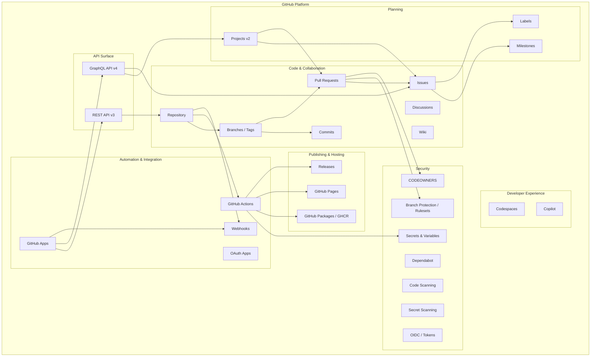
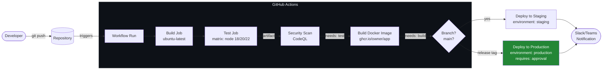
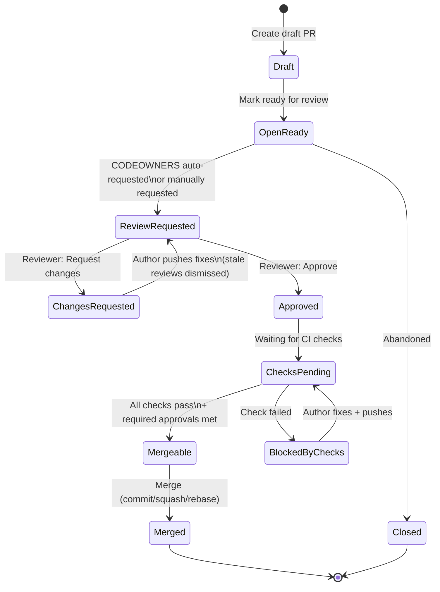
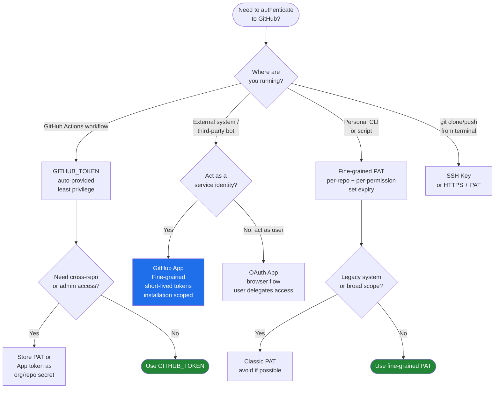
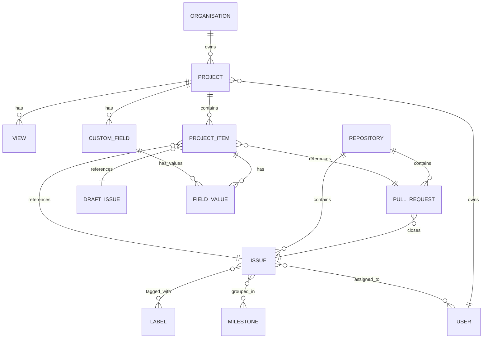
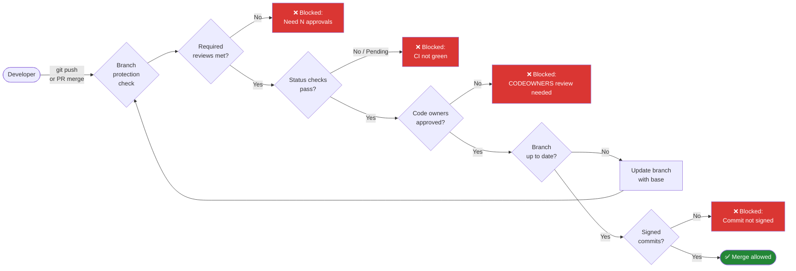
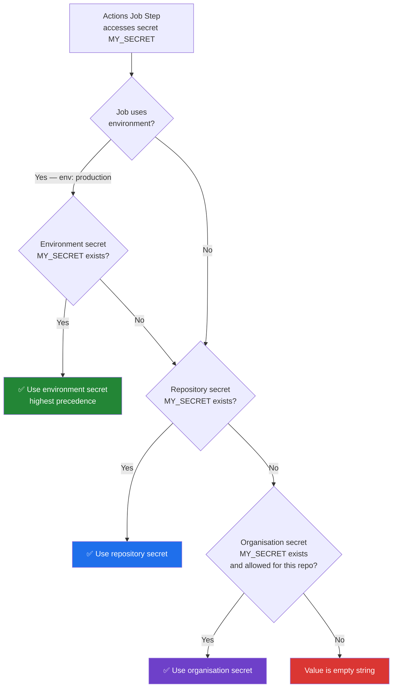
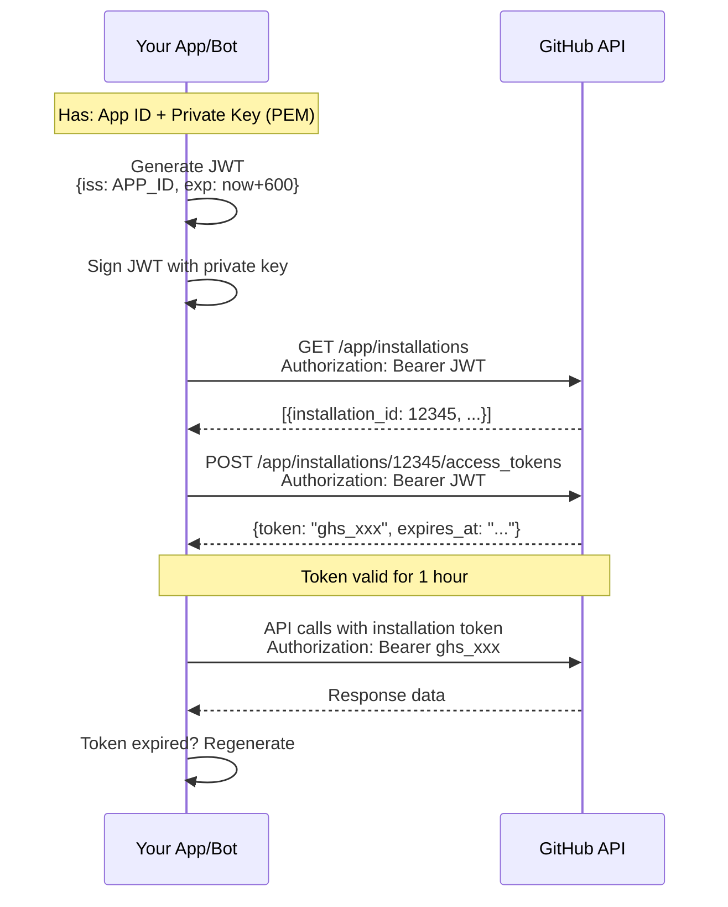
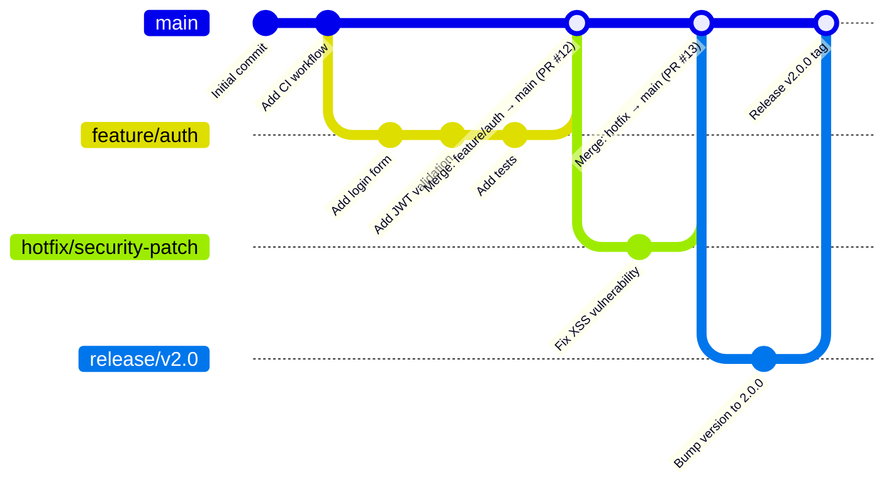
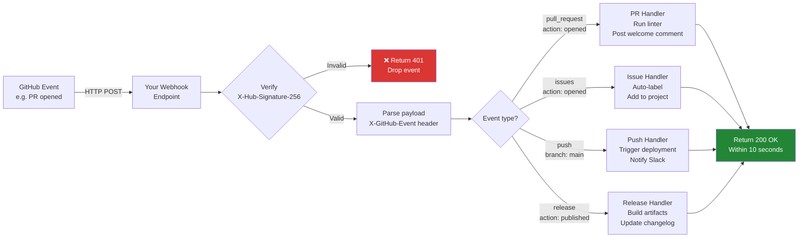

# GitHub Platform Architecture Diagrams

All diagrams use Mermaid syntax. Render in GitHub, VS Code (Mermaid Preview), or mermaid.live.

---

## 1. Platform Component Map

---

## 2. CI/CD Pipeline Flow

---

## 3. Pull Request Review Lifecycle

---

## 4. GitHub Authentication Decision Tree

---

## 5. GitHub Projects v2 Data Flow

---

## 6. Branch Protection / Ruleset Enforcement Flow

---

## 7. GitHub Actions Secret Precedence

---

## 8. GitHub App Authentication Flow

---

## 9. Repository Branching Strategy (GitHub Flow)

---

## 10. Webhook Event Processing

